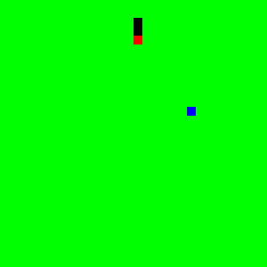
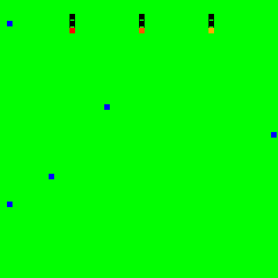

# gym-snake

#### Created in response to OpenAI's [Requests for Research 2.0](https://blog.openai.com/requests-for-research-2/)

## Description
gym-snake is a multi-agent implementation of the classic game [snake](https://www.youtube.com/watch?v=wDbTP0B94AM) that is made as an OpenAI gym environment.

Currently only a single file is available.

## Dependencies
- pip
- gym
- numpy
- matplotlib

## Installation
1. Clone this repository
2. Navigate to the cloned repository
3. Run command `$ pip install -e ./`

## Using gym-snake
After installation, you can use gym-snake by making one of two gym environments.

#### SnakeEnv
Use `gym.make('snake-v0')` to make a new snake environment with the following default options (see Game Details to understand what each variable does):

    grid_size = [15,15]
    unit_size = 10
    unit_gap = 1
    snake_size = 3
    n_snakes = 1
    n_foods = 1

#### SnakeExtraHardEnv
Use `gym.make('snake-plural-v0')` to make a new snake environment with the following default parameters (see Game Details to understand what each variable does):

    grid_size = [25,25]
    unit_size = 10
    unit_gap = 1
    snake_size = 5
    n_snakes = 3
    n_foods = 2

## Game Details
You're probably familiar with the game of snake. This is an OpenAI gym implementation of the game with multi snake and multi food options.

#### Rewards
A +1 reward is returned when a snake eats a food.

A -1 reward is returned when a snake dies.

No extra reward is given for victory snakes in plural play.

#### Game Options

- _grid_size_ - An x,y coordinate denoting the number of units on the snake grid (width, height).
- _unit_size_ - Number of numpy pixels within a single grid unit.
- _unit_gap_ - Number of pixels separating each unit of the grid. Space between the units can be useful to understand the direction of the snake's body.
- _snake_size_ - Number of body units for each snake at start of game
- _n_snakes_ - Number of individual snakes on grid
- _n_foods_ - Number of food units (the stuff that makes the snakes grow) on the grid at any given time.

Each of these options are member variables of the environment and will come into effect after the environment is reset.

Default setting for `snake-v0` play, 15x15 unit grid.

Default setting for `snake-plural-v0` play, 25x25 unit grid.

Result of setting `env.unit_gap` to 0.

Result of setting `env.unit_gap` to a large number.

Here's a really big grid with lots of food and small snakes.

#### General Info
The snake environment has three main interacting classes to construct the environment. The three are a Snake class, a Grid class, and a Controller class. Each holds information about the environment, and each can be accessed through the gym environment.

    import gym
    import gym_snake

    # Construct Environment
    env = gym.make('snake-v0')
    observation = env.reset() # Constructs an instance of the game

    # Controller
    game_controller = env.controller

    # Grid
    grid_object = game_controller.grid
    grid_pixels = grid_object.grid

    # Snake(s)
    snakes_array = game_controller.snakes
    snake_object1 = snakes[0]

#### Using Multiple Snakes
The only differences with using multiple snakes is that at each step, you pass an array of actions corresponding to the action of each snake. The return is an array of rewards corresponding each snake. The reward returned upon a snakes' death is -1, each subsequent step after this, however, is a reward of 0. The contents of the action array are ignored at a dead snake's index, the action array must, however, continue to have an index for each snake that originally started out the game.

#### Coordinates
The units of the game are made to take up multiple pixels within the grid. Each unit has an x,y coordinate associated with it where (0,0) represents the uppermost left unit of the grid and (`grid_object.grid_size[0]`, `grid_object.grid_size[1]`) denotes the lowermost right unit of the grid. Positional information about snake food and snakes' bodies is encoded using this coordinate system.

#### Snake Class
This class holds all pertinent information about an individual snake. Useful information includes:

    # Action constants denote the action space.
    snake_object1.UP # Equal to integer 0
    snake_object1.RIGHT # Equal to integer 1
    snake_object1.DOWN # Equal to integer 2
    snake_object1.LEFT # Equal to integer 3

    # Member Variables
    snake_object1.direction # Indicates which direction the snake's head is pointing; initially points DOWN
    snake_object1.head # x,y Coordinate of the snake's head
    snake_object1.head_color # A pixel ([R,G,B]) of type uint8 with an R value of 255
    snake_object1.body # deque containing the coordinates of the snake's body ordered from tail to neck [furthest from head, ..., closest to head]

#### Grid Class
This class holds all pertinent information about the grid that the snakes move on. Useful information includes:

    # Color constants give information about the colors of the grid
    # Each are ndarrays with dtype uint8
    grid_object.BODY_COLOR # [1,0,0] Color of snake body units
    grid_object.HEAD_COLOR # [255, 0, 0] Color of snake head units. The G value [R,G,B] varies with multiple snakes.
    grid_object.FOOD_COLOR # [0,0,255] Color of food units
    grid_object.SPACE_COLOR # [0,255,0] Color of blank space

    # Member Variables
    grid_object.unit_size # See Game Options
    grid_object.unit_gap # See Game Options
    grid_object.grid_size # See Game Options
    grid_object.grid # Numpy [R,G,B] pixel array of game

#### Controller Class
The Controller holds a grid object and an array of snakes that move on the grid. The Controller class handles the game logic between the snakes and the grid. Actions are taken through this class and initialization parameters within this class dictate the initial parameters of the grid and snake objects in the game. Useful information includes:

    # Member variables
    game_controller.grid # An instance of the grid class for the game
    self.snakes # An array of snake objects that are on the board. If a snake dies, it is erased and it becomes None.
